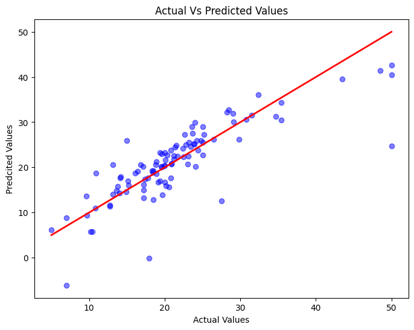
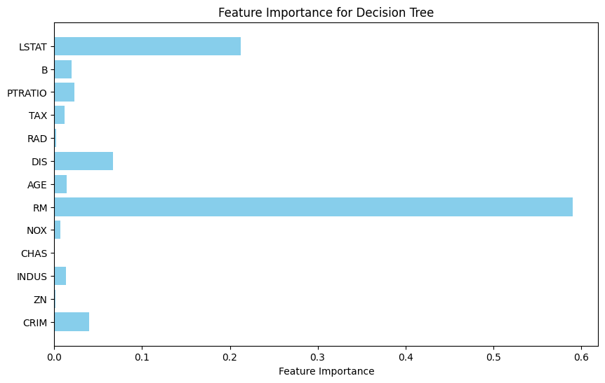

# 🏠 Boston House Price Prediction

A machine learning project using the Boston Housing dataset to predict house prices. This notebook explores several regression models, evaluates their performance, and visualizes results.

## 📌 Dataset
The Boston Housing Dataset contains 506 rows and 14 attributes describing housing prices in Boston suburbs.

## 🧠 Models Implemented

| Model                    | Description                               |
|--------------------------|-------------------------------------------|
| Linear Regression        | Baseline model for understanding trends   |
| Polynomial Regression    | Captures nonlinear relationships          |
| Decision Tree Regression | Tree-based model with feature importance  |
| Random Forest Regression | Ensemble technique to improve accuracy    |
| Support Vector Regression| Uses RBF kernel for complex relationships |
| Ridge & Lasso Regression | Regularization to prevent overfitting     |


## 🔍 Techniques Used

- Correlation Analysis
- Feature Engineering & Scaling
- Residual Analysis & Visualization
- Cross-Validation (K-Fold)
- Regularization (Ridge, Lasso)

## 📊 Evaluation Metrics

- **Mean Squared Error (MSE)**
- **Mean Absolute Error (MAE)**
- **R² Score**

## 📈 Visualizations
- Actual vs Predicted
- Residual Plots
- Feature Importance
- Learning Curve
- Cross-Validation Results

## ⚙️ Installation
1. Clone the repository:
   ```bash
   git clone https://github.com/shahmi0519/Boston-House-Price-Prediction.git
   ```
2. Install dependencies:
   ```bash
   pip install -r requirements.txt
   ```
   **requirements.txt**:
   ```
   pandas
   numpy
   matplotlib
   seaborn
   scikit-learn
   ```
3. Run the notebook:
   ```bash
   jupyter notebook notebooks/boston_house_prediction.ipynb
   ```
---

## 📸 Sample Visualization



---

## 📂 Project Structure
```bash
├── data/                  # Dataset
├── notebooks/             # Jupyter notebooks
├── images/                # Graphs & charts
├── requirements.txt       # Project dependencies
└── README.md              # Project overview
```
---

## ✍️ Author
**Ahamed Shahmi A.J**
- **📧 Mail**: [`shahmiahamed0519@gmail.com`](mailto:shahmiahamed0519@gmail.com)
- **🔗 LinkedIn**: [`Ahamed Shahmi`](https://www.linkedin.com/in/ahamed-shahmi-abduljabbar/)
- **💻 GitHub**: [`shahmi0519`](https://github.com/shahmi0519)
---
## 📝 License
This project is licensed under the MIT License – see the [LICENSE](LICENSE) file for details.
